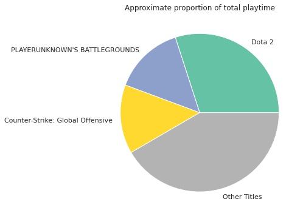
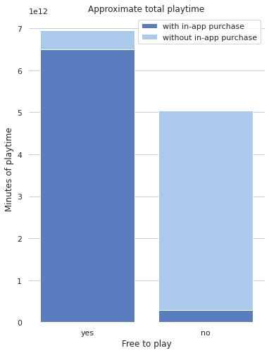

# The Gaming Trends on Steam

Steam is the biggest game distribution platform in the world with a whopping of [21,000 titles](https://leftronic.com/steam-statistics/) in 2020. But which titles are being played the most and which genres are popular? Is there a game or a genre that dominate the rest?

During my first project in Udacity's Data Scientist Nanodegree, I attempted to find answers for these enquiries

## Directory

This repository contains two notebooks and two datasets.

- `data_cleaning.ipynb` cleans the raw dataset
- `data_visualization.ipynb` provides visualizations for analysis
- `steam.csv` is the raw original dataset
- `processed_steam.csv` is the pre-processed dataset
- `graph/` contains useful graphs for visualization

## Results

Here are a quick summary of the analysis, these results are covered in detail in my blog post.

1. Three titles *Dota 2*, *PLAYERUNKNOWN'S BATTLEGROUND* and *Counter-Strike: Global Offensive* dominate 60% of total playtime on Steam

2. *Action* is so far the most popular genre

 

3. *Free-to-play* games with *in-app purchases* is the way to go

## Acknowledgement

This analysis uses [Steam Store Games](https://www.kaggle.com/nikdavis/steam-store-games) dataset, which contains steam data gathered from [the Steam Store and SteamSpy APIs](https://nik-davis.github.io/posts/2019/steam-data-collection/) around May 2019.

## License
[MIT](LICENSE)